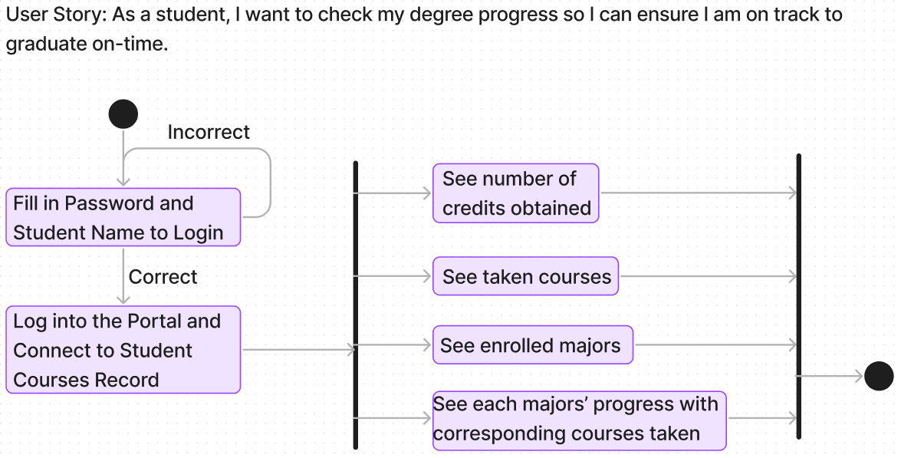
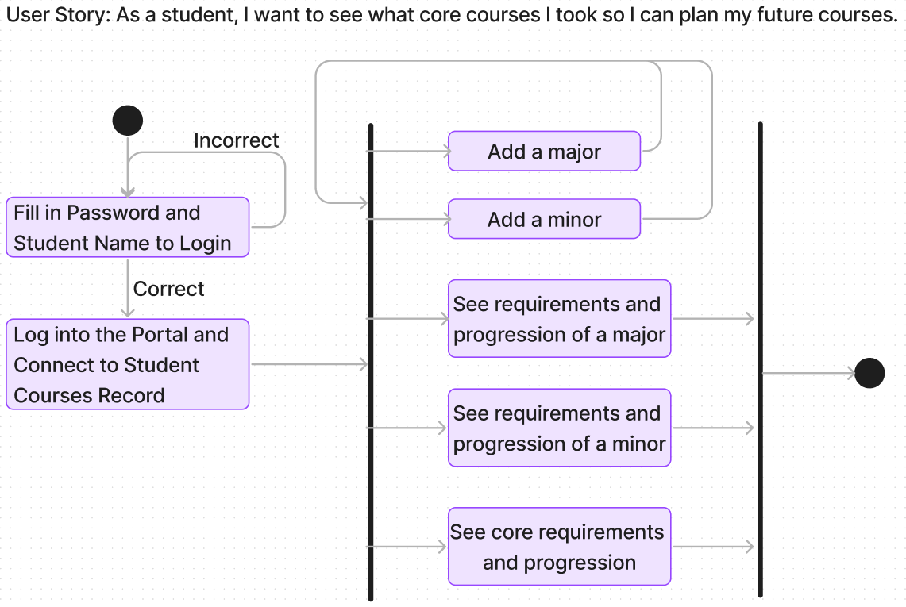

# Specification Phase Exercise

A little exercise to get started with the specification phase of the software development lifecycle. See the [instructions](instructions.md) for more detail.

## Team members

Harrison Douglass: <https://github.com/hpdouglass> 
Yvonne (Yiyi) Wu: <https://github.com/Yvonne511> 
Brandon Chen: <https://github.com/b-chen00> 
Ziyuan(Jerry) Chen: <https://github.com/JerryChen21>

## Stakeholders

### Romeo Kumar (Assistant Director of the Computer Science Department and academic advisor)

#### Goals

* Ensure students progress towards the completion of their major by mapping out a course sequence based on requirements and taken courses.

* Help students become aware of residency requirements after declaring a major.

* Transferring and updating requirements for students that have taken classes at Abu Dhabi, Shanghai or Tandon

#### Frustrations

* Students often ask for course recommendations when such information is best decided by oneself through looking at the course material and emailing the professors directly.

* AP Credit for CSCI-UA 101 is not automatically applied.

* Having to issue "Class Permission Codes" for students trying to register for CSCI-UA 102, because ALBERT does not recognize their AP Credits.

* Writing multiple memos for students that have satisfied course equivalencies at other divisions of NYU that have been pre-approved.

* Overall repetition of emails and memos.

### Henry Lam (student)

#### Goal

* What courses do I need to take in order to graduate?

* What courses have I taken already?

* How many credits have I taken?

* What prerequisites do I need to take? (What order should I take my courses?)

* Can I fit a minor into my degree progression?

#### Frustrations

* Degree progress report does not provide a readable user-friendly interface.

* Too hard to navigate as there are many tabs/links.

* It doesn’t tell me what courses I should take next semester or how many free electives I can take. (There is an Academic Planner but it isn't help and does the minimum. Stakeholder usually seek guidance from academic advisors rather than the degree progress report or academic planner)

### Dan Lu (student)

#### Goals

* View outstanding degree requirements in an easy-to-understand summary that differentiates between different requirement types (i.e. minimum GPA requirements are different from a requirement to take a specific class, which are both different from a requirement to take a specific number of classes of a certain type, etc.).

* Map out the prerequisite tree for a given class, for a set of selected classes, or for an entire program of study.

* Be able to add and remove majors and minors to see progress towards a major or minor a student is considering.

* Plan which courses a student will take each semester to allow all requirements and prerequisites to be met.

#### Frustrations

* Feature is hidden, it appears only as a small link and is not particularly easy to find.

* Completed requirements are hidden. While this is helpful, no indication is made why these requirements are hidden.

* In the summary for each requirement, distinction is not made between completed classes and classes in-progress. Completed classes and classes in-progress are both marked as "taken," which is not as helpful.

## Product Vision Statement

Provide an interactive platform for NYU students to view and track accurate information about their degree progress and requirements to facilitate an improved understanding of college academic life.

## User Requirements

As a student, I want to see what core courses I took so I can plan my future courses.

As a student, I want to check my degree progress so I can ensure I am on track to graduate on-time.

As a student, I want to see how many free electives I have so I can make the best use of my credits.

As a student, I want course recommendations so I know what courses will keep me on track to graduate.

As a student, I want to see my credits and fulfilled requirement so I can save time and effort.

As a student, I want to see what my degree progress would look like if I added or dropped a major or minor, so I can plan my course of study.

As a student, I want to map out the entire prerequisite tree for courses or programs of study.

As a student, I want to plan which courses I will take in which semesters to ensure all requirements and prerequisites are met.

As a student, I want to see the comments from those who take the courses and professors' requirements.

As a student, I want to check which course is less stressful, so I can balance the stress in my study process.

As an academic advisor, I want an informative degree progress report so that students most students can be guided without my help.

## Activity Diagrams

The Figma page containing our UML diagrams can be found here: <https://www.figma.com/file/lwYg4YBIge8dhsDkltuneb/UML-Diagrams-(Community)>
